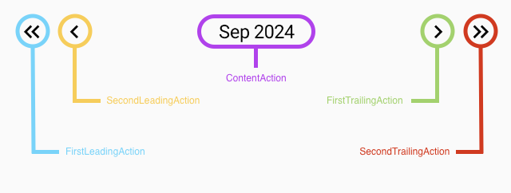
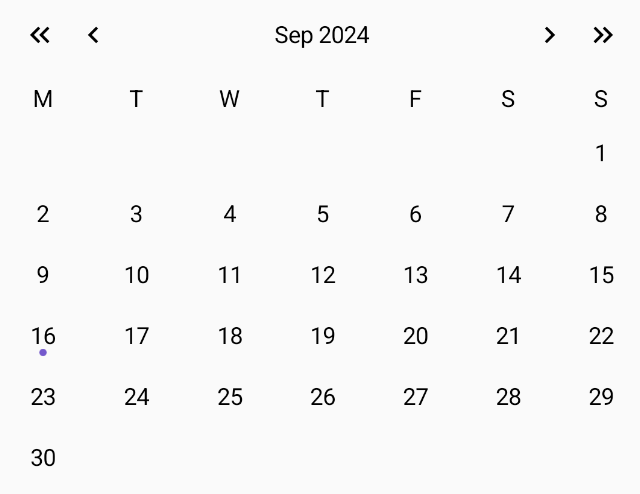
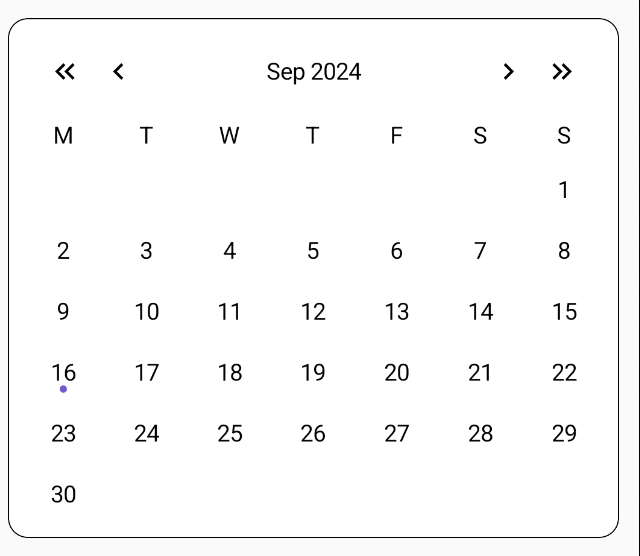
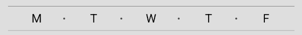
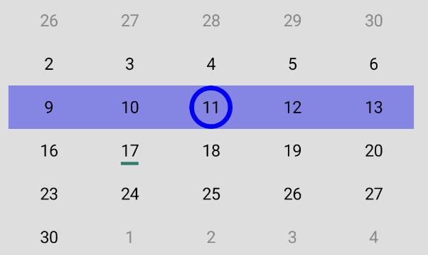
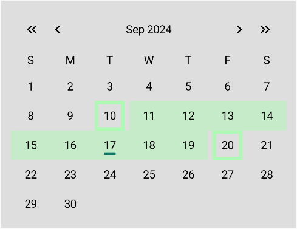

# Calendar Library Documentation

## Overview

A calendar library with fully customizable UI and helper for generating the calendar data .

## Including in your project

## Gradle

Add the dependency below to your module's build.gradle file:

```gradle
dependencies {
    implementation("io.github.leosvjetlicic:calendar-library:1.0.0")
}
```

## How to Use

The library is created to be used in kotlin and jetpack compose projects.
It consists of the UI and helper class for generating the calendar data.

### ICalendarViewState

In the library there is an interface `ICalendarViewState` which contains the needed properties for
the calendar view state.
The `CalendarHeaderViewState` is only a value of String type that is supposed to show the current
month and maybe the year.
The `CalendarWeekDaysViewState` is a value of List type that contains the names of the days of
the week.
The `CalendarDaysViewState` is a value of List type that contains the days of the month.

``` kotlin 
interface ICalendarViewState {
    val headerViewState: CalendarHeaderViewState
    val weekDaysViewState: CalendarWeekDaysViewState
    val daysViewState: CalendarDaysViewState
}
```

Every day is represented with the `ICalendarDay` type that enables us to inherit from it and add
properties we need.

``` kotlin
interface ICalendarDay {
    val value: LocalDate
    val isSelected: Boolean
    val isCurrentMonth: Boolean
    val isToday: Boolean
}
```

When inheriting from the `ICalendarViewState`interface, classes can add their own properties, for
example the range of
selected days, which we will talk about later. For simple use cases the `DefaultCalendarViewState`
provided within the library is enough. It doesn't have any extra properties.

``` kotlin 
data class DefaultCalendarViewState(
    override val headerViewState: CalendarHeaderViewState,
    override val weekDaysViewState: CalendarWeekDaysViewState,
    override val daysViewState: CalendarDaysViewState
) : ICalendarViewState
```

### Helper

In the library there is an interface `ICalendarHelper` which contains the needed methods for
generating the calendar data.
The `BaseCalendarHelper` implements the `ICalendarHelper` interface and gives base method
implementations except the abstract function `generateCalendarViewState`,
which is used to create the `ICalendarViewState` type objects and will depend on the type of the
`ICalendarViewState` created.
In order to create a helper, we need to pass a list of days in the week that are of
type `DayOfWeek`.
The days need to be in the same order as the days in the week, but there are no restrictions in the
sense of how many days there are. For example we can pass days to create only week days:

``` kotlin
private val helperWorkDays = SimpleCalendarHelper(
    listOf(
        DayOfWeek.MONDAY,
        DayOfWeek.TUESDAY,
        DayOfWeek.WEDNESDAY,
        DayOfWeek.THURSDAY,
        DayOfWeek.FRIDAY,
    )
)
```

or we can pass days to make the week start with a sunday:

``` kotlin
private val helperStartWithSunday = RangeCalendarHelper(
    listOf(
        DayOfWeek.SUNDAY,
        DayOfWeek.MONDAY,
        DayOfWeek.TUESDAY,
        DayOfWeek.WEDNESDAY,
        DayOfWeek.THURSDAY,
        DayOfWeek.FRIDAY,
        DayOfWeek.SATURDAY,
    )
)
```

Aside from the parameters, we need to override the `generateCalendarViewState` method, and if we
need to we can override the other methods as well (`getDaysOfWeekNames`, `generateWeeks`).

In the following code snippet is given a simple way of overriding the `generateCalendarViewState`
method, that gives us the `DefaultCalendarViewState`, a class that inherits
from `ICalendarViewState` and only overrides the needed values (there are no extra parameters):

``` kotlin
override fun generateCalendarViewState(
        year: Int,
        month: Month,
        weekDayStyle: TextStyle,
        monthStyle: TextStyle,
        locale: Locale,
        selected: Selected?
    ): DefaultCalendarViewState {
        val currentDay = LocalDate.now()
        val weeks = generateWeeks(year, month)
        return DefaultCalendarViewState(
            headerViewState = CalendarHeaderViewState(
                currentDate = month.getDisplayName(monthStyle, locale) + " $year"
            ),
            weekDaysViewState = CalendarWeekDaysViewState(getDaysOfWeekNames(weekDayStyle, locale)),
            daysViewState = CalendarDaysViewState(
                days = weeks.map { days ->
                    days.map { day ->
                        CalendarDayViewState(
                            value = day,
                            isSelected =
                            selected is Selected.SingleDay && selected.day != null &&
                                    selected.day == day,
                            isToday = day == currentDay,
                            isCurrentMonth = day.month == month && day.year == year
                        )
                    }
                }
            )
        )
    }
```

### Calendar UI

Now that we have out basic view state, the `DefaultCalendarViewState` we can look at creating the UI
with the data we have.
The `Calendar` compose function is structured in such a way that follows the `ICalendarViewState`.
Meaning it is separated into 3 main parts, the header, the week days (e.g. Monday - Sunday) and the
days.
The best thing about this library is that it is very customisable. We can change every part of the
calendar either by creating a completely new look, or modifying the existing one. We will see that
later in all the examples, but for now lets look at the `DefaultCalendarExample`.

``` kotlin
@Composable
fun DefaultCalendarExample(
    viewState: ICalendarViewState,
    modifier: Modifier = Modifier,
    onHeaderAction: (CalendarHeaderAction) -> Unit,
    onDayClick: (LocalDate) -> Unit
) {
    Calendar(
        modifier = modifier
            .fillMaxWidth()
            .padding(12.dp)
            .clip(RoundedCornerShape(12.dp))
            .background(Color.White)
            .border(width = 0.5.dp, shape = RoundedCornerShape(12.dp), color = Color.Black)
            .padding(8.dp),
        viewState = viewState,
        onHeaderAction = onHeaderAction,
        onDayClick = onDayClick
    )
}
```

By passing the viewState, onHeaderAction and onDayClick we have a fully functional calendar.
The `onHeaderAction` is a function that has a `CalendarHeaderAction` as a
parameter. `CalendarHeaderAction` is a sealed class with 5 data objects inheriting it.
This enables us to have 5 different functionalities in the header of the calendar.
Of course if you don't want to use all of them you use only some like it will be shown in the
example later.

``` kotlin
sealed interface CalendarHeaderAction

data object FirstLeadingAction : CalendarHeaderAction
data object SecondLeadingAction : CalendarHeaderAction
data object ContentAction : CalendarHeaderAction
data object FirstTrailingAction : CalendarHeaderAction
data object SecondTrailingAction : CalendarHeaderAction
```

The data objects are placed and used in the DefaultCalendarExample for example like this


and this is how they are used in code (we pass different data objects as parameters for different
actions in the onAction function):

``` kotlin
@Composable
fun BaseCalendarHeader(
    viewState: CalendarHeaderViewState,
    modifier: Modifier = Modifier,
    onAction: (CalendarHeaderAction) -> Unit,
    firstLeadingContent: @Composable () -> Unit = {
        DefaultCalendarHeaderActionButtonContent(
            iconId = R.drawable.ic_left_double,
            onClick = { onAction(FirstLeadingAction) })
    },
    secondLeadingContent: @Composable () -> Unit = {
        DefaultCalendarHeaderActionButtonContent(
            iconId = R.drawable.ic_left_single,
            onClick = { onAction(SecondLeadingAction) })
    },
    firstTrailingContent: @Composable () -> Unit = {
        DefaultCalendarHeaderActionButtonContent(
            iconId = R.drawable.ic_right_single,
            onClick = { onAction(FirstTrailingAction) })
    },
    secondTrailingContent: @Composable () -> Unit = {
        DefaultCalendarHeaderActionButtonContent(
            iconId = R.drawable.ic_right_double,
            onClick = { onAction(SecondTrailingAction) })
    },
    content: @Composable RowScope.() -> Unit = {
        DefaultCalendarHeaderContent(viewState = viewState, onAction = onAction)
    }
) {
...
}
```

And by adding modifiers we made the calendar look better, and that is only the beginning because of
calendars customizability we can update and change the look of every part of the calendar.





### ViewModel

In order to make the calendars more persistent, there is a `BaseViewModel` provided in the library
that has default implementations for `onDayClick` and `onHeaderAction` functions.
In order to make this work, we need to create a helper, pass it to view model, with the selected
day/s and a function that tells how to copy the viewState (it doesn't have a copy() function since
it is an interface) and then pass the view models viewState to the calendar, like so:

``` kotlin
// Creating the helper

private val helper1 = DefaultCalendarHelper(
        listOf(
            DayOfWeek.MONDAY,
            DayOfWeek.TUESDAY,
            DayOfWeek.WEDNESDAY,
            DayOfWeek.THURSDAY,
            DayOfWeek.FRIDAY,
            DayOfWeek.SATURDAY,
            DayOfWeek.SUNDAY,
        )
    ) 
```

``` kotlin
// Creating the view model 

// viewState is the original view state, 
// daysViewState is the new days view state

// you can use a DI tool or a factory to create the view model

val viewModel1 by viewModels<BaseViewModel> {
        BaseViewModelFactory(helper = helper1, onCopy = { viewState, daysViewState, _ ->
            (viewState as DefaultCalendarViewState).copy(daysViewState = daysViewState)
        }, selected = Selected.SingleDay(null))
    }
```

``` kotlin
//Passing the view model to the calendar 

@Composable
fun DefaultCalendarWithViewModel(
    defaultViewModel: BaseViewModel,
    modifier: Modifier = Modifier
) {
    DefaultCalendarExample(
        modifier = modifier,
        viewState = defaultViewModel.viewState.value,
        onHeaderAction = defaultViewModel::onHeaderAction,
        onDayClick = defaultViewModel::onDayClick
    )
}
```

After that we have a self dependent calendar that persists when there are changes like phone
orientation change.

## Examples

Now that we have explained the possibilities of the library we are going to show them through some
examples. One was already explained earlier, the `DefaultCalendarExample`, so there are only 2
examples left, the `SimpleCalendarExample` that will focus more on the UI part of the library, and
then a `RangeCalendarExample` that will show how to implement a range function with the calendar,
customizing both the UI and the Helper.

### SimpleCalendarExample

In order to show how customizable the UI of the library is, this example was created. It will show
you how you can modify the existing look and create or add to a completely new look.

#### Data

We will create a new viewState inheriting the `ICalendarViewState` and adding a new parameter
today that will be used in the `extra content` subtopic.

``` kotlin
data class SimpleCalendarViewState(
    override val headerViewState: CalendarHeaderViewState,
    override val weekDaysViewState: CalendarWeekDaysViewState,
    override val daysViewState: CalendarDaysViewState,
    val today: String
) : ICalendarViewState
```

Now that we have a new viewState we will need to create a new Helper that will generate the new view
state by overriding the `generateCalendarViewState` method like this:

``` kotlin
override fun generateCalendarViewState(
        year: Int,
        month: Month,
        weekDayStyle: TextStyle,
        monthStyle: TextStyle,
        locale: Locale,
        selected: Selected?
    ): com.leosvjetlicic.library.examples.simpleexample.SimpleCalendarViewState {
        val currentDay = LocalDate.now()
        val weeks = generateWeeks(year, month)
        return com.leosvjetlicic.library.examples.simpleexample.SimpleCalendarViewState(
            headerViewState = CalendarHeaderViewState(
                currentDate = month.getDisplayName(monthStyle, locale) + " $year"
            ),
            weekDaysViewState = CalendarWeekDaysViewState(getDaysOfWeekNames(weekDayStyle, locale)),
            daysViewState = CalendarDaysViewState(
                days = weeks.map { days ->
                    days.map { day ->
                        CalendarDayViewState(
                            value = day,
                            isSelected = selected is Selected.SingleDay && selected.day != null &&
                                    selected.day == day,
                            isToday = day == currentDay,
                            isCurrentMonth = day.month == month && day.year == year
                        )
                    }
                }
            ),
            today = currentDay.format(DateTimeFormatter.ofPattern("d MMMM yyyy"))
        )
    }
```

Now we can create the helper and since this example uses only week days, we need to create a helper
variable that will generate them:

``` kotlin
 private val helperWorkDays = SimpleCalendarHelper(
        listOf(
            DayOfWeek.MONDAY,
            DayOfWeek.TUESDAY,
            DayOfWeek.WEDNESDAY,
            DayOfWeek.THURSDAY,
            DayOfWeek.FRIDAY,
        )
    )
```

#### Header

In order to change the header look completely, we need to create it like in the code below:

``` kotlin
@Composable
fun SimpleHeader(
    viewState: CalendarHeaderViewState,
    modifier: Modifier = Modifier,
    invertedOrder: Boolean = false,
    onAction: (CalendarHeaderAction) -> Unit,
    firstIconContent: @Composable () -> Unit = {
        SimpleCalendarHeaderActionButtonContent(
            iconId = R.drawable.ic_left_single,
            onClick = { onAction(SecondLeadingAction) })
    },
    secondIconContent: @Composable () -> Unit = {
        SimpleCalendarHeaderActionButtonContent(
            iconId = R.drawable.ic_right_single,
            onClick = { onAction(FirstTrailingAction) })
    },
    content: @Composable RowScope.() -> Unit = {
        SimpleCalendarHeaderActionTextContent(
            viewState = viewState,
            onAction = onAction
        )
    }
) {
    Row(
        modifier = modifier,
        verticalAlignment = Alignment.CenterVertically,
        horizontalArrangement = Arrangement.SpaceBetween
    ) {
        if (!invertedOrder) {
            content()
        }
        Row {
            firstIconContent()
            secondIconContent()
        }
        if (invertedOrder) {
            content()
        }
    }
}
```

In the code above we removed 2 icons and made the other 2 a little bigger, also we changed the order
of the whole header as opposed of the
default header. Now that we have it, we simply pass it to the calendar as the header parameter:

``` kotlin
 Calendar(
        ...    
        header = {
            SimpleHeader(
                modifier = Modifier.fillMaxWidth(),
                viewState = viewState.headerViewState,
                onAction = onHeaderAction
            )
        }
        ...
```

#### Week Days

Next are week days, based on the parameter `style` and `locale` you pass in the `getDaysOfWeekNames`
function that you can override from the `BaseCalendarHelper` or the `ICalendarHelper` interface, the
value of type `String` of each day will change. The default value is just the first letter of the
day (`TextStyle.NARROW`).



So the content of week days stays same but in order to show how easily we can add elements to the
existing look, we will recreate the image above and add 2 lines at both the top and bottom, and dots
between each day:

``` kotlin
@Composable
fun SimpleWeekDays(
    viewState: CalendarWeekDaysViewState,
    modifier: Modifier = Modifier,
    alignment: Alignment.Vertical = Alignment.CenterVertically,
    arrangement: Arrangement.Horizontal = Arrangement.SpaceAround,
    textStyle: TextStyle = TextStyle.Default,
) {
    Column(modifier = modifier) {
        Spacer(
            modifier = Modifier
                .fillMaxWidth()
                .height(0.3.dp)
                .background(Color.DarkGray)
        )
        Row(
            modifier = Modifier.padding(vertical = 6.dp),
            verticalAlignment = alignment,
            horizontalArrangement = arrangement
        ) {
            viewState.daysOfWeek.forEachIndexed { index, it ->
                Spacer(
                    modifier = Modifier
                        .clip(CircleShape)
                        .size(2.dp)
                        .background(Color.Transparent)
                )
                Text(
                    modifier = Modifier.weight(1f),
                    text = it,
                    style = textStyle,
                    textAlign = TextAlign.Center
                )
                Spacer(
                    modifier = Modifier
                        .clip(CircleShape)
                        .size(2.dp)
                        .background(
                            if (index != viewState.daysOfWeek.size - 1) {
                                Color.DarkGray
                            } else {
                                Color.Transparent
                            }
                        )
                )
            }
        }
        Spacer(
            modifier = Modifier
                .fillMaxWidth()
                .height(0.3.dp)
                .background(Color.DarkGray)
        )
    }
}
```

#### Days

When it comes to days we will edit both the week (`Row`) and each day,
Week, with which we will just color the whole row if there is a day selected in it:

``` kotlin
@Composable
fun SimpleDays(
    viewState: CalendarDaysViewState,
    modifier: Modifier = Modifier,
    onClick: (LocalDate) -> Unit = {},
    content: @Composable RowScope.(ICalendarDay) -> Unit = { day ->
        SimpleDay(day = day, onClick = onClick)
    }
) {
    CalendarDays(
        viewState = viewState,
        modifier = modifier,
        onClick = onClick
    ) { weekDays ->
        Row(
            modifier = modifier
                .fillMaxWidth()
                .background(
                    if (weekDays.any { it.isSelected }) {
                        Color.Blue.copy(alpha = 0.4f)
                    } else {
                        Color.Transparent
                    }
                ),
            verticalAlignment = Alignment.CenterVertically,
            horizontalArrangement = Arrangement.SpaceEvenly
        ) {
            weekDays.forEach { day ->
                content(day)
            }
        }
    }
}
```

And we will edit the day by changing its content (colors and indicator shape).
The indicator is just a small shape under the day text that usually represents if the day is today.
Firstly because we added extra content in between week days names, the days would not match by
column, so we will need to add the `weight` modifier to it like this (this is taken from
the `SimpleDay` Compose function):

``` kotlin
CalendarDay(
        modifier = modifier.weight(1f),
        viewState = day,
        content = {
            content()
        }
    )
```

Now we can change the look of the content. By passing different modifiers and colors we can change
the look how ever we won't. There is quite a lot of code for it so i won't copy and paste all of it
here. Rather I will show some more important parts and list the names of the Compose functions.

- `SimpleDayContent`
- `BaseCalendarDayContent`
- `BaseCalendarDayTextContent`

The most important thing to take from the Compose functions above is the size calculation of each
day so the single digit days are shown in the middle the same way as double digit numbers, also it
helps with making the width and height values equal so when for example we want to draw a circle on
the day we can draw it perfectly in the middle.

``` kotlin
modifier = modifier
            .onSizeChanged {
                width = it.width
                height = it.height
            }
            .heightIn(min = with(density) {
                if (height < width) {
                    width.toDp()
                } else {
                    height.toDp()
                }
            })
            .widthIn(min = with(density) {
                if (width < height) {
                    height.toDp()
                } else {
                    width.toDp()
                }
            })
            .clip(shape)
            .then(
                if (viewState.isCurrentMonth) {
                    Modifier
                        .clickable {
                            onClick(viewState.value)
                        }
                } else {
                    Modifier
                }
            )
            .background(
                if (viewState.isSelected && viewState.isCurrentMonth) {
                    selectedBackgroundColor
                } else {
                    unselectedBackgroundColor
                }
            )
            .padding(paddingValues),
```

The result looks like this:



#### Extra Content

We can also add extra content to every part of the calendar, so in this example it is added at the
bottom and it shows the `today` parameter in the viewState by passing this as the content in
the `Calendar` Composable function:

``` kotlin
content = {
            SimpleDays(
                viewState = viewState.daysViewState,
                onClick = onDayClick
            )
            Spacer(
                modifier = Modifier
                    .fillMaxWidth()
                    .height(0.3.dp)
                    .background(Color.DarkGray)
            )
            Column(modifier = Modifier.padding(top = 12.dp)) {
                Row(
                    verticalAlignment = Alignment.CenterVertically
                ) {
                    Text(
                        text = "Today's date: ",
                        fontSize = 20.sp,
                        fontWeight = FontWeight.Bold
                    )
                    Text(
                        text = viewState.today,
                        fontSize = 16.sp,
                    )
                }
            }
        }
```

and it looks like this:


This is the finished product, completely different than the `DefaultCalendarExample`:


### RangeCalendarExample

The `RangeCalendarExample` was created to show how to implement a range function with the calendar
and handle all its basic click events.

#### Data

Firstly we need to override the `ICalendarViewState` interface and add a new
parameter `selectedRange` like so:

``` kotlin
data class RangeCalendarViewState(
    override val headerViewState: CalendarHeaderViewState,
    override val weekDaysViewState: CalendarWeekDaysViewState,
    override val daysViewState: CalendarDaysViewState,
    val selectedRange: Selected.DayRange
) : ICalendarViewState
```

Also in order to be able to show if the day is in range or not we need to override
the `ICalendarDay` and add the parameter:

``` kotlin
data class RangeCalendarDay(
    override val value: LocalDate,
    override val isSelected: Boolean,
    override val isCurrentMonth: Boolean,
    override val isToday: Boolean,
    val isInRange: Boolean
) : ICalendarDay
```

Now we need to override the `BaseCalendarHelper` and the `generateCalendarViewState` like so:

``` kotlin
override fun generateCalendarViewState(
        year: Int,
        month: Month,
        weekDayStyle: TextStyle,
        monthStyle: TextStyle,
        locale: Locale,
        selected: Selected?
    ): com.leosvjetlicic.library.examples.rangeexample.RangeCalendarViewState {
        val currentDay = LocalDate.now()
        val weeks = generateWeeks(year, month)
        val tempSelected = if (selected != null) {
            (selected as Selected.DayRange)
        } else {
            Selected.DayRange(null, null)
        }
        return com.leosvjetlicic.library.examples.rangeexample.RangeCalendarViewState(
            headerViewState = CalendarHeaderViewState(
                currentDate = month.getDisplayName(monthStyle, locale) + " $year"
            ),
            weekDaysViewState = CalendarWeekDaysViewState(getDaysOfWeekNames(weekDayStyle, locale)),
            daysViewState = CalendarDaysViewState(
                days = weeks.map { days ->
                    days.map { day ->
                        RangeCalendarDay(
                            value = day,
                            isSelected = day == tempSelected.startDay || day == tempSelected.endDay,
                            isToday = day == currentDay,
                            isCurrentMonth = day.monthValue == month.value && day.year == year,
                            isInRange = if (tempSelected.startDay != null && tempSelected.endDay != null) {
                                tempSelected.startDay!! < day && tempSelected.endDay!! > day
                            } else {
                                false
                            }
                        )
                    }
                }
            ),
            selectedRange = tempSelected
        )
    }
```

Up until now the `selected` parameter was always of type `SingleDay`, but now when we create the
helper we need to define this parameter will be `DayRange`. We will do that in the part where we
create the viewState:

``` kotlin
 var viewState3 by remember {
        mutableStateOf(
            helper2.generateCalendarViewState(
                year = currentYear,
                month = currentMonth,
                selected = Selected.DayRange(null, null)
            )
        )
    }
```

We will also need to add it as a parameter when copying the viewState like this:

``` kotlin
viewState.value = copyViewState(
            viewState.value,
            newDaysViewState,
            selected
        )
```

This is part of the `RangeViewModel` in the `onDayClick` function you can just copy in your project
if you want the same behavior.
It allows you to select 2 days and everything between them will be "in range". If you unselect one
the range will obviously disappear.



### Get Started & Contribute

We hope this documentation helps you get started with the calendar library.

We welcome your feedback and contributions. You can report
any issues you encounter on our Github
repository https://github.com/LeoSvjetlicic/CalendarLibrary/tree/main.

