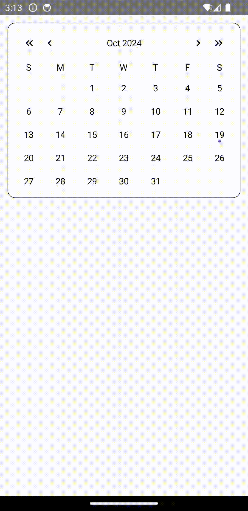

# Calendar Library

A calendar library with fully customizable UI and helper for generating the calendar data in Android projects using Kotlin and Jetpack Compose.

**With this library you will be able to create a calendar Ui to your liking and with the exact features you want**




## Features
* **Customizable** UI components for calendars
* Easy handling of date selection and range selection
* Easily extend functionality with custom features
* Helper functions for **generating calendar data**
* Integrates seamlessly with **Jetpack Compose ViewModel**


## Sample project
The GIFs above showcase some examples provided in the sample app, you can download [here](https://github.com/LeoSvjetlicic/CalendarLibrary/archive/refs/heads/main.zip).

View the library's source code [here](https://github.com/LeoSvjetlicic/CalendarLibrary/tree/main/calendarLibrary)

## Setup
To be able to use the library you need to add the following dependency to your project:

```gradle
dependencies {
    implementation("io.github.leosvjetlicic:calendar-library:1.2.0")
}
```

## Usage

The library is separated into **3 main parts**:

* **ViewState**: Defines data the UI will render and what the helper should output.
* **Helper**: Creates data for the calendar.
* **UI**: Renders the calendar and handles click events.

### UI

For detailed parameter description of library composable functions you can find [here](https://github.com/LeoSvjetlicic/CalendarLibrary/blob/main/docs/composables/Composables.md).

### ViewStates

The library provides ViewState interfaces you need to inherit from in order to use the libraries in
the best way.

#### ICalendarViewState
- allows you to add custom element that will be rendered on the UI.

```kotlin
interface ICalendarViewState {
  val headerViewState: CalendarHeaderViewState
  val weekDaysViewState: CalendarWeekDaysViewState
  val daysViewState: CalendarDaysViewState
}
```

Compulsory parameters:

* `CalendarHeaderViewState` - Element for passing data to the header
* `CalendarWeekDaysViewState` - Days of the week names
* `CalendarDaysViewState` - Days of the month represented by `ICalendarDay`

#### ICalendarDay
- allows you to add new parameters to classes that represent the days in the calendar.

```kotlin
interface ICalendarDay {
  val value: LocalDate
  val isSelected: Boolean
  val isCurrentMonth: Boolean
  val isToday: Boolean
}
```

Compulsory parameters:

* `value` - day of the month
* `isSelected` - is the day selected by the user
* `isCurrentMonth` - is the day in the current month
* `isToday` - is the day today's date

### Helper

The library provides a helper `ICalendarHelper` that is used to generate data for the calendar.

```kotlin
interface ICalendarHelper {
  val weekDays: List<DayOfWeek>

  fun getDaysOfWeekNames(
    style: TextStyle,
    locale: Locale
  ): List<String>

  fun generateWeeks(
    year: Int = LocalDate.now().year,
    month: Month = LocalDate.now().month
  ): List<List<LocalDate>>

  fun generateCalendarViewState(
    year: Int = LocalDate.now().year,
    month: Month = LocalDate.now().month,
    weekDayStyle: TextStyle = TextStyle.NARROW,
    monthStyle: TextStyle = TextStyle.SHORT,
    locale: Locale = Locale.getDefault(),
    selected: Selected? = null
  ): ICalendarViewState
}
```

Compulsory elements:

* `weekDays` - week days list
* `getDaysOfWeekNames` - gives the list of weekday names in a format you want
* `generateWeeks` - generates the calendar days
* `generateCalendarViewState` - maps the data to the view state

In order to make the usage easier, the library also provides a `BaseCalendarHelper` that implements everything above except the
`generateCalendarViewState`.

You can find a detailed explanation on how to use the library in the documentation links below.

### Examples
* **[Default Calendar Example](https://github.com/LeoSvjetlicic/CalendarLibrary/tree/main/docs/examples/defaultcalendar/DefaultCalendar.md)**
  - Calendar with minimal customizations
    * [ViewState](https://github.com/LeoSvjetlicic/CalendarLibrary/tree/main/docs/examples/defaultcalendar/DefaultCalendar.md/#ViewState)
    * [Helper](https://github.com/LeoSvjetlicic/CalendarLibrary/tree/main/docs/examples/defaultcalendar/DefaultCalendar.md/#Helper)
    * [UI](https://github.com/LeoSvjetlicic/CalendarLibrary/tree/main/docs/examples/defaultcalendar/DefaultCalendar.md/#UI)
    * [ViewModel](https://github.com/LeoSvjetlicic/CalendarLibrary/tree/main/docs/examples/defaultcalendar/DefaultCalendar.md/#ViewModel)

* **[Simple Calendar Example](https://github.com/LeoSvjetlicic/CalendarLibrary/tree/main/docs/examples/simplecalendar/SimpleCalendar.md)**
  - Calendar with customizations mainly in the UI
    * [ViewState](https://github.com/LeoSvjetlicic/CalendarLibrary/tree/main/docs/examples/simplecalendar/SimpleCalendar.md/#ViewState)
    * [Helper](https://github.com/LeoSvjetlicic/CalendarLibrary/tree/main/docs/examples/simplecalendar/SimpleCalendar.md/#Helper)
    * [UI](https://github.com/LeoSvjetlicic/CalendarLibrary/tree/main/docs/examples/simplecalendar/SimpleCalendar.md/#UI)
    * [ViewModel](https://github.com/LeoSvjetlicic/CalendarLibrary/tree/main/docs/examples/simplecalendar/SimpleCalendar.md/#ViewModel)
  
* **[Range Calendar Example](https://github.com/LeoSvjetlicic/CalendarLibrary/tree/main/docs/examples/rangecalendar/RangeCalendar.md)**
  - Calendar with customizations in the features
    * [ViewState](https://github.com/LeoSvjetlicic/CalendarLibrary/tree/main/docs/examples/rangecalendar/RangeCalendar.md/#ViewState)
    * [Helper](https://github.com/LeoSvjetlicic/CalendarLibrary/tree/main/docs/examples/rangecalendar/RangeCalendar.md/#Helper)
    * [UI](https://github.com/LeoSvjetlicic/CalendarLibrary/tree/main/docs/examples/rangecalendar/RangeCalendar.md/#UI)
    * [ViewModel](https://github.com/LeoSvjetlicic/CalendarLibrary/tree/main/docs/examples/rangecalendar/RangeCalendar.md/#ViewModel)

* **[Default Range Calendar Example](https://github.com/LeoSvjetlicic/CalendarLibrary/tree/main/docs/examples/defaultrangecalendar/DefaultRangeCalendar.md)**
  - Calendar that looks like the `Default Calendar` but with the features as the `Range Calendar`
    * [ViewState](https://github.com/LeoSvjetlicic/CalendarLibrary/tree/main/docs/examples/defaultrangecalendar/DefaultRangeCalendar.md/#ViewState)
    * [Helper](https://github.com/LeoSvjetlicic/CalendarLibrary/tree/main/docs/examples/defaultrangecalendar/DefaultRangeCalendar.md/#Helper)
    * [UI](https://github.com/LeoSvjetlicic/CalendarLibrary/tree/main/docs/examples/defaultrangecalendar/DefaultRangeCalendar.md/#UI)
    * [ViewModel](https://github.com/LeoSvjetlicic/CalendarLibrary/tree/main/docs/examples/defaultrangecalendar/DefaultRangeCalendar.md/#ViewModel)

## Contribute
If you have any ideas or maybe you found a bug, feel free to send a pull request or [open a issue](https://github.com/LeoSvjetlicic/CalendarLibrary/issues)

## Licence
Calendar library is distributed under the MIT licence. See [LICENCE](https://github.com/LeoSvjetlicic/CalendarLibrary/blob/main/LICENSE) for more.
