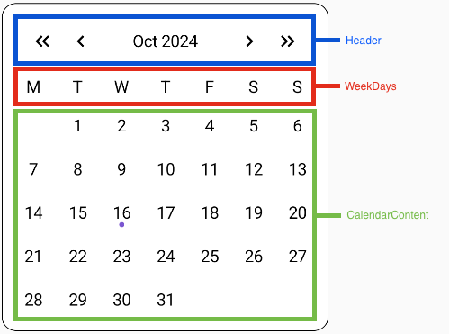
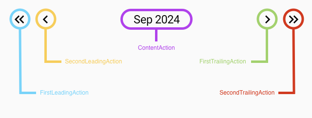
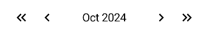
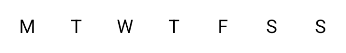
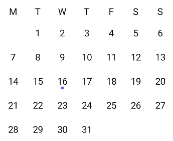
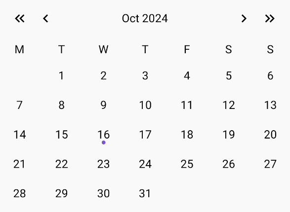

# Composables

In the following content we will show you how the Compose functions in the library work, and how to use them.
The Calendar UI is separated into 3 main parts:
  * Header
  * WeekDays
  * CalendarContent



We will explain each part of the calendar UI in the same structure as listed above.

## Content
* [Header](#header)
  * [BaseActionButtonContent](#BaseActionButtonContent)
  * [BaseCalendarHeaderContent](#BaseCalendarHeaderContent)
  * [CalendarHeader](#CalendarHeader)
  * [BaseCalendarHeader](#BaseCalendarHeader)
* [WeekDays](#WeekDays)
  * [CalendarWeekDays](#CalendarWeekDays)
  * [BaseCalendarWeekDays](#BaseCalendarWeekDays)
* [CalendarContent](#CalendarContent)
  * [BaseCalendarDayIndicator](#BaseCalendarDayIndicator)
  * [BaseCalendarDayTextContent](#BaseCalendarDayTextContent)
  * [BaseCalendarDayContent](#BaseCalendarDayContent)
  * [CalendarDay](#CalendarDay)
  * [CalendarDaysRow](#CalendarDaysRow)
  * [CalendarDays](#CalendarDays)
* [Calendar](#Calendar)


## Header

As seen in the image above, the header is the top part of the calendar.
It allows you to show some content and interact with the calendar trough `CalendarHeaderAction`.



There are 5 predefined actions, which are defined as follows:
```kotlin
sealed interface CalendarHeaderAction

data object FirstLeadingAction : CalendarHeaderAction
data object SecondLeadingAction : CalendarHeaderAction
data object ContentAction : CalendarHeaderAction
data object FirstTrailingAction : CalendarHeaderAction
data object SecondTrailingAction : CalendarHeaderAction
```

You use them by passing them as a parameter trough a function like this:
``` kotlin
  ...
  onHeaderAction: (CalendarHeaderAction) -> Unit,
  ...
```
Finally, define what each function will do in your ViewModel or at the top-level Compose function, like this:
``` kotlin
fun onHeaderAction(action: CalendarHeaderAction) {
        when (action) {
            SecondLeadingAction -> {
                ...
            }
            FirstTrailingAction -> {
                ...
            }
            FirstLeadingAction -> {
                ...
            }
            SecondTrailingAction -> {
                ...
            }
            ContentAction -> {
                ...
            }
        }
    }
```
Now that we covered the actions in the header, let's look at how to customize the header Compose function.

To create a header you can create everything from scratch by yourself or use the 2 "building blocks" provided by the library:
  * BaseActionButtonContent - arrow buttons in the example above
  * BaseCalendarHeaderContent - the text in the example above

### BaseActionButtonContent
The `BaseActionButtonContent` composable function is basically just an icon with a few parameters you can use to modify it, as you can see here:
``` kotlin
@Composable
fun BaseActionButtonContent(
    @DrawableRes iconId: Int,
    modifier: Modifier = Modifier,
    shape: Shape = CircleShape,
    contentDescription: String = "",
    iconTint: Color = Black,
    paddingValues: PaddingValues = PaddingValues(6.dp),
    iconSize: Dp = 20.dp,
    onClick: () -> Unit
) {
    ...
}
```
Parameters:
* `iconId` - Resource ID of the icon
* `modifier` - Modifier to style icon
* `shape` - Shape of the button
* `contentDescription` - Content description of the icon
* `iconTint` - Color of the icon
* `paddingValues` - Padding around the icon
* `iconSize` - Size of the icon
* `onClick` - A lambda that is triggered when the button is clicked

### BaseCalendarHeaderContent
The `BaseCalendarHeaderContent` composable function is a Text with a few parameters you can use to modify it, as you can see here:
``` kotlin
@Composable
fun BaseCalendarHeaderContent(
    viewState: CalendarHeaderViewState,
    modifier: Modifier = Modifier,
    textStyle: TextStyle = TextStyle.Default.copy(color = Black),
    shape: Shape = RoundedCornerShape(8.dp),
    paddingValues: PaddingValues = PaddingValues(8.dp, 16.dp),
    onAction: (ContentAction) -> Unit
) {
    ...
}
```
Parameters:
* `viewState` - `CalendarHeaderViewState` (A String representation of what you want to show in the header) 
* `modifier` - Modifier to style the Text Compose function
* `textStyle` - Text style
* `shape` - Shape of the text
* `paddingValues` - Padding around the text
* `onAction` - A lambda that is triggered when the text is clicked

### BaseCalendarHeader
Now that we have the building blocks, we can create the basic header. It will contain 4 `BaseActionButtonContent` and 1 `BaseCalendarHeaderContent`.

We pass them as parameters to the `BaseCalendarHeader` function:
``` kotlin
@Composable
@Composable
fun BaseCalendarHeader(
    ...
    firstLeadingContent: @Composable () -> Unit,
    secondLeadingContent: @Composable () -> Unit,
    firstTrailingContent: @Composable () -> Unit,
    secondTrailingContent: @Composable () -> Unit,
    content: @Composable RowScope.() -> Unit 
) {
    ...
}
```
We also need to pass the following
* `onAction` - lambda function triggered in click actions.
* `viewState` - `CalendarHeaderViewState`.
* `modifier` - optional.
``` kotlin
@Composable
fun BaseCalendarHeader(
    viewState: CalendarHeaderViewState,
    modifier: Modifier = Modifier,
    onAction: (CalendarHeaderAction) -> Unit,
    ...
) {
    ...
}
```
Finally, all of these parameters are used in the following way:
``` kotlin
@Composable
fun BaseCalendarHeader(
  ...
) {
    Row(
        modifier = modifier,
        verticalAlignment = Alignment.CenterVertically,
        horizontalArrangement = Arrangement.SpaceBetween
    ) {
        Row {
            firstLeadingContent()
            secondLeadingContent()
        }
        content()
        Row {
            firstTrailingContent()
            secondTrailingContent()
        }
    }
}
```
* 2 action buttons of each side of the content, 
  * the first 2 are labeled as the "leading" (in front of the content), 
  * the second 2 are labeled as the "trailing" (behind the content).
  
The elements in the header are all optional, meaning you can choose which ones you want to show.

### CalendarHeader
Now that we basically defined everything previously, we created the `CalendarHeader` composable function to enable **further customization** by either using modifiers, or adding your own content. 
In the end we get a header that looks like this:
``` kotlin
@Composable
fun CalendarHeader(
    viewState: CalendarHeaderViewState,
    modifier: Modifier = Modifier,
    onAction: (CalendarHeaderAction) -> Unit,
    content: @Composable () -> Unit = {
      ...
    },
) {
    content()
}
```

And basically by just passing the `BaseCalendarHeader` as the **content** above, we have the following header:



Now since we created the "container" `CalendarHeader` you can add whatever content you want to show in the header, as well as the `BaseCalendarHeader`.


## WeekDays
WeekDays represent the middle part of the calendar UI and show the days of the week.

The Compose function show basically a list of week day names in a wanted format as seen in the image below:



### BaseCalendarWeekDays
The Compose function `BaseCalendarWeekDays` is a simple way to show the week days with a few parameters you can use to modify it, as you can see here:
``` kotlin
@Composable
internal fun BaseCalendarWeekDays(
    viewState: CalendarWeekDaysViewState,
    modifier: Modifier = Modifier,
    alignment: Alignment.Vertical = Alignment.CenterVertically,
    arrangement: Arrangement.Horizontal = Arrangement.SpaceAround,
    textStyle: TextStyle = TextStyle.Default,
) {
    ...
}
```
Parameters:
* `viewState` - `CalendarWeekDaysViewState` list of week day names in a wanted format
* `modifier` - Modifier to style the Row
* `alignment` - Element alignment in the Row
* `arrangement` - Element arrangement in the Row
* `textStyle` - Text style

The days are put in a `Row` element with the applied parameters above like this:
``` kotlin
@Composable
fun BaseCalendarWeekDays(
    ...
) {
    Row(
        modifier = modifier,
        verticalAlignment = alignment,
        horizontalArrangement = arrangement
    ) {
        viewState.daysOfWeek.forEach { day ->
            Text(
                modifier = Modifier.weight(1f),
                text = day,
                style = textStyle,
                textAlign = TextAlign.Center
            )
        }
    }
}
```

The `weight` modifier is used so each day takes up as much space as it can. This way they are spaced evenly in the `Row`.

### CalendarWeekDays
Now with the `BaseCalendarWeekDays` we can create the `CalendarWeekDays` composable function to enable **further customization** by either using modifiers, or adding your own content.

It would work as a sort of container, by passing the `BaseCalendarWeekDays` as the **content**, along with the `viewState` and `modifier`, in the code below, we get the basic WeekDays UI:
``` kotlin
@Composable
fun CalendarWeekDays(
    viewState: CalendarWeekDaysViewState,
    modifier: Modifier = Modifier,
    content: @Composable () -> Unit = {
        DefaultCalendarWeekDays(viewState = viewState, modifier = modifier)
    }
) {
    content()
}
```
Because it serves as a container, we can add other content to it, like **lines**, **dots**, etc., which can be seen in [this example]([Composables.md](https://github.com/LeoSvjetlicic/CalendarLibrary/blob/main/docs/simplecalendar/SimpleCalendar.md)) 

## CalendarContent
`CalendarContent` forms the core of the calendar UI, displaying the grid of days for a given month. 
It is the largest and most interactive component of the calendar

It allows users to:
* view
* select
* interact 
with individual days.

In the subtopics below you will see how the `CalendarContent` is created, by using small composable functions and combining them into larger ones, until we get something that looks like this:



### BaseCalendarDayIndicator
`BaseCalendarDayIndicator` is a composable function used to visually **highlight** a specific day with an indicator. In the image above, it is represented by the **purple dot**, which marks the current date.
It is created by customizing the appearance of a Spacer composable function like so:
``` kotlin
@Composable
fun BoxScope.BaseCalendarDayIndicator(
    modifier: Modifier = Modifier,
    indicatorColor: Color = Purple,
    indicatorSize: Dp = 4.5.dp,
) {
    Spacer(
        modifier = modifier
            .align(Alignment.BottomCenter)
            .size(indicatorSize)
            .clip(CircleShape)
            .background(indicatorColor)
    )
}
```
Parameters:
* `modifier` - Modifier to style the indicator
* `indicatorColor` - Color of the indicator
* `indicatorSize` - Size of the indicator

It is also used in a BoxScope for easier positioning in the `CalendarDay`, which is explained [here](#CalendarDay)

### BaseCalendarDayTextContent
`BaseCalendarDayTextContent` is a composable function used to **display** the number value of a day in the calendar. 

This are the parameters used in the function:
``` kotlin
@Composable
fun BoxScope.BaseCalendarDayTextContent(
    viewState: ICalendarDay,
    modifier: Modifier = Modifier,
    selectedTextColor: Color = White,
    unselectedTextColor: Color = Black,
    notCurrentMonthTextColor: Color = Transparent,
    textPadding: Dp = 4.dp,
    fontSize: TextUnit = TextUnit.Unspecified,
    fontStyle: FontStyle? = null,
    fontWeight: FontWeight? = null,
    fontFamily: FontFamily? = null,
    minWidth: Dp = 0.dp
) {
    ...
}
```
Parameters:
* `viewState` - Your viewState inherited from the `ICalendarDay` explained [here]((https://github.com/LeoSvjetlicic/CalendarLibrary/blob/main/README.md/ViewStates/#ICalendarDay))  
* `modifier` - Modifier to style the Text
* `selectedTextColor` - Color of the selected day
* `unselectedTextColor` - Color of the unselected day
* `notCurrentMonthTextColor` - Color of the day that is not in the current month
* `textPadding` - Padding of the Text
* `fontSize` - Font size of the Text
* `fontStyle` - Style of the Text
* `fontWeight` - Weight of the Text
* `fontFamily` - Font Family of the Text
* `minWidth` - Minimum width of the Text

The parameters are used to style the `Text` composable function like this: 
``` kotlin
@Composable
fun BoxScope.BaseCalendarDayTextContent(
    ...
) {
    Text(
        modifier = modifier
            .widthIn(min = minWidth)
            .padding(textPadding)
            .align(
                alignment = Alignment.Center
            ),
        textAlign = TextAlign.Center,
        text = viewState.value.dayOfMonth.toString(),
        color = if (viewState.isCurrentMonth) {
            if (viewState.isSelected) {
                selectedTextColor
            } else {
                unselectedTextColor
            }
        } else {
            notCurrentMonthTextColor
        },
        fontSize = fontSize,
        fontStyle = fontStyle,
        fontFamily = fontFamily,
        fontWeight = fontWeight
    )
}
```
* The `align` modifier is used to aligns the `Text` to the center of the `BoxScope`, which allows us to not depend weather the the day has 1 or 2 digits 
* The color is used to style the `Text` depending on whether the day is selected or not, and whether the day is in the current month or not. 
  * Allows us to make the days not in the current month transparent
  
### BaseCalendarDayContent
By combining the previous two composable functions, we can create the complete content for the calendar day content.
The `BaseCalendarDayContent` composable function is a `Box` that positions and styles the content provided.

It takes these parameters:
``` kotlin
@Composable
fun BaseCalendarDayContent(
    viewState: ICalendarDay,
    modifier: Modifier = Modifier,
    shape: Shape = CircleShape,
    paddingValues: PaddingValues = PaddingValues(6.dp),
    selectedBackgroundColor: Color = LightPurple,
    unselectedBackgroundColor: Color = Transparent,
    content: @Composable BoxScope.() -> Unit = {
        ...
    },
    indicator: @Composable BoxScope.() -> Unit = {
        ...
    },
    onClick: (LocalDate) -> Unit
) {
...
}
```
Parameters:
* `viewState` - Your viewState inherited from the `ICalendarDay` explained [here]((https://github.com/LeoSvjetlicic/CalendarLibrary/blob/main/README.md/ViewStates/#ICalendarDay))
* `modifier` - Modifier to style the Box
* `shape` - Shape of the Box
* `paddingValues` - Padding of the Box
* `selectedBackgroundColor` - Color of the selected day
* `unselectedBackgroundColor` - Color of the unselected day
* `content` - Content of the Box
* `indicator` - Indicator of the Box
* `onClick` - A lambda that is triggered when the Box is clicked

The parameters above are used to style the `Box` composable function that looks like this. 

``` kotlin
@Composable
fun BaseCalendarDayContent(
    ...
) {
    ...
    Box(
      ...
    ) {
        content()
        if (viewState.isToday) {
            indicator()
        }
    }
}
```
It basically holds the `content` and the `indicator` and aligns them accordingly.

We also use a list of modifiers to get the following behaviours:
* width equal to height
``` kotlin
@Composable
fun BaseCalendarDayContent(
    ...
) {
    var width by remember { mutableIntStateOf(0) }
    var height by remember { mutableIntStateOf(0) }
    val density = LocalDensity.current
    Box(
        modifier = modifier
            .onSizeChanged {
                width = it.width
                height = it.height
            }
            .heightIn(min = with(density) {
                if (height < width) {
                    width.toDp()
                } else {
                    height.toDp()
                }
            })
            .widthIn(min = with(density) {
                if (width < height) {
                    height.toDp()
                } else {
                    width.toDp()
                }
            })
            ...
    ) {
       ...
    }
}
```
By setting the values of `width` and `height` to the width and height of the `Box` respectively, we can make sure the dimensions are equal.

The main reason behind it that it makes the ripple effect (when clicking) and background look even and better.

* enable click if the day is in the current month
``` kotlin
@Composable
fun BaseCalendarDayContent(
    ...
) {
    ...
    Box(
        modifier = modifier
            ...
            .then(
                if (viewState.isCurrentMonth) {
                    Modifier
                        .clickable {
                            onClick(viewState.value)
                        }
                } else {
                    Modifier
                }
            )
            ...
    ) {
        ...
    }
}
```

* change background depending on the isSelected and isCurrentMonth values
``` kotlin
@Composable
fun BaseCalendarDayContent(
    ...
) {
    ...
    Box(
        modifier = modifier
            ...
            .background(
                if (viewState.isSelected && viewState.isCurrentMonth) {
                    selectedBackgroundColor
                } else {
                    unselectedBackgroundColor
                }
            )
            .padding(paddingValues),
    ) {
        ...
    }
}
```
* we also apply the `padding` and `clip` modifiers to the `Box`

### CalendarDay
As we have seen before, we can combine all of the previous composable functions to create the `CalendarDay` composable function that would serve as a container.
The function looks like this:
``` kotlin
@Composable
fun CalendarDay(
    viewState: ICalendarDay,
    modifier: Modifier = Modifier,
    onClick: (LocalDate) -> Unit = {},
    content: @Composable BoxScope.(ICalendarDay) -> Unit = {
        ...
    },
    helperContent: @Composable BoxScope.() -> Unit = {}
) {
    Box(
        modifier = modifier
    ) {
        content(viewState)
        helperContent()
    }
}
```
Parameters:
* `viewState` - Your viewState inherited from the `ICalendarDay` explained [here]((https://github.com/LeoSvjetlicic/CalendarLibrary/blob/main/README.md/ViewStates/#ICalendarDay))
* `modifier` - Modifier to style the Box
* `onClick` - A lambda that is triggered when the Box is clicked
* `content` - The content explained in the previous topic
* `helperContent` - Helper content of the Box (empty by default)

Both the `content` and `helperContent` are set to be used in a `BoxScope` so you can align them however you want or place them on top one another.

### CalendarDaysRow
`CalendarDaysRow` is a composable function that is used to display a list of days in a row. 
It looks like this:
``` kotlin
@Composable
fun CalendarDaysRow(
    viewState: List<ICalendarDay>,
    modifier: Modifier = Modifier,
    alignment: Alignment.Vertical = Alignment.CenterVertically,
    arrangement: Arrangement.Horizontal = Arrangement.SpaceEvenly,
    onClick: (LocalDate) -> Unit = {},
    day: @Composable RowScope.(ICalendarDay) -> Unit = {
        ...
    }
) {
    Row(
        modifier = modifier.fillMaxWidth(),
        verticalAlignment = alignment,
        horizontalArrangement = arrangement
    ) {
        viewState.forEach {
            day(it)
        }
    }
}
```
Parameters:
* `viewState` - List of your `ICalendarDay` viewStates
* `modifier` - Modifier to style the Row
* `alignment` - The vertical alignment of the days
* `arrangement` - The horizontal arrangement of the days
* `onClick` - A lambda that is triggered when a day is clicked
* `day` - The content explained in the previous topic

The composable function renders the elements next to each other in a row with the `arrangement` and `alignment` passed as parameters. 

### CalendarDays
`CalendarDays` is the final compose function that is a grid of days created by stacking `CalendarDaysRow` below one another in a `Column` like so:
``` kotlin
@Composable
fun CalendarDays(
    viewState: CalendarDaysViewState,
    modifier: Modifier = Modifier,
    onClick: (LocalDate) -> Unit = {},
    dayContent: @Composable (List<ICalendarDay>) -> Unit = {
      ...
    }
) {
    Column(modifier = modifier) {
        for (week in viewState.days) {
            dayContent(week)
        }
    }
}
```
Parameters:
* `viewState` - "Matrix (lists in lists)" of `ICalendarDay` viewStates
* `modifier` - Modifier to style the Column
* `onClick` - A lambda that is triggered when a day is clicked
* `dayContent` - The content explained in the previous topic

## Calendar
By combining all the elements we explained above, we can create the `Calendar` composable function that looks like this:



The image above was created by adding all the main components together in a `Column` like this:

``` kotlin
@Composable
fun Calendar(
    viewState: ICalendarViewState,
    modifier: Modifier = Modifier,
    onHeaderAction: (CalendarHeaderAction) -> Unit,
    onDayClick: (LocalDate) -> Unit = {},
    header: @Composable () -> Unit = {
        ...
    },
    weekDays: @Composable () -> Unit = {
        ...
    },
    content: @Composable () -> Unit = {
        ...
    }
) {
    Column(modifier = modifier) {
        header()
        weekDays()
        content()
    }
}
```
Parameters:
* `viewState` - Your viewState inherited from the `ICalendarViewState` explained [here]((https://github.com/LeoSvjetlicic/CalendarLibrary/blob/main/README.md/ViewStates/#ICalendarViewState))
* `modifier` - Modifier to style the Column
* `onHeaderAction` - A lambda that is triggered when the header action is clicked
* `onDayClick` - A lambda that is triggered when a day is clicked
* `header` - The header composable function
* `weekDays` - The week days composable function
* `content` - The content composable function

Apart from the above, each of the composable functions are passed a modifier `fillMaxWidth`.

## Conclusion
To better understand how to use the composable functions the library offers, please visit the [Examples.md](https://github.com/LeoSvjetlicic/CalendarLibrary/blob/main/docs/examples) folder, where you can go trough 4 different examples and see how they were created. 
