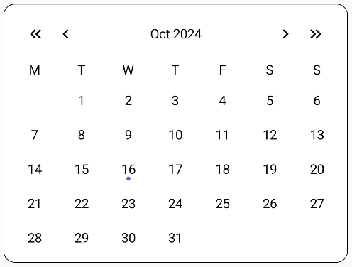

# DefaultCalendar

This example shows the how to use the basic functionalities and UI of the library.

The end result will look like this:



**Content**:
* [ViewState](#viewstate)
* [Helper](#helper)
* [UI](#ui)
* [ViewModel](#viewmodel)

## ViewState
Firstly you need to create a ViewState that will hold the data you want to display on the calendar.

You can do so by inheriting from `ICalendarViewState` like so:
``` kotlin
    data class DefaultCalendarViewState(
        override val headerViewState: CalendarHeaderViewState,
        override val weekDaysViewState: CalendarWeekDaysViewState,
        override val daysViewState: CalendarDaysViewState
    ) : ICalendarViewState
```

Also you need to create a class that will represent a *day*. You can do so by inheriting from `ICalendarDay` like so:
``` kotlin
    data class CalendarDayViewState(
        override val value: LocalDate,
        override val isSelected: Boolean,
        override val isCurrentMonth: Boolean,
        override val isToday: Boolean
    ) : ICalendarDay
```
Both ViewStates are explained in the [README.md](https://github.com/LeoSvjetlicic/CalendarLibrary/blob/main/README.md/ViewStates) file. 

## Helper
Now that you have the data you want to show, you need to **generate** it.

The library provides:
* `ICalendarHelper` - defines the needed methods for generating the calendar data  
* `BaseCalendarHelper` - provides the basic implementation of the  functions, except the `generateCalendarViewState` function.

You can do so by **inheriting** from `BaseCalendarHelper` like this:

``` kotlin
class DefaultCalendarHelper(
    override val weekDays: List<DayOfWeek>
) : BaseCalendarHelper(weekDays) {
    ...
}
```
The class already implements the basic functions, except the `generateCalendarViewState` function.

The function returns a `ICalendarViewState`, which is why you needed to create your ViewState from it, and it looks like this:
``` kotlin
    override fun generateCalendarViewState(
        year: Int,
        month: Month,
        weekDayStyle: TextStyle,
        monthStyle: TextStyle,
        locale: Locale,
        selected: Selected?
    ): DefaultCalendarViewState {
        ...
    }
```
Parameters:
* **year** - The year for which to generate the calendar (defaults to current year).
* **month** - The month for which to generate the calendar (defaults to current month).
* **weekDayStyle** - The style of the week days (defaults to `TextStyle.NARROW`).
* **monthStyle** - The style of the month names (defaults to `TextStyle.SHORT`).
* **locale** - The locale for which to generate the calendar (defaults to `Locale.getDefault()`).
* **selected** - The selected date of type [Selected](https://github.com/LeoSvjetlicic/CalendarLibrary/blob/main/calendarLibrary/src/main/java/com/leosvjetlicic/calendarlibrary/utils/Selected.kt).

It basically maps the data you get from the `generateWeeks` and `getDaysOfWeekNames` functions to the DefaultCalendarViewState you created earlier.

You call the functions like this:
``` kotlin
    override fun generateCalendarViewState(
        ...
    ): DefaultCalendarViewState {
        val currentDay = LocalDate.now()
        val weeks = generateWeeks(year, month)
        ...
    }
```
Then you create the `DefaultCalendarViewState` by creating and passing the data in the following snippets:

``` kotlin
    override fun generateCalendarViewState(
        ...
    ): DefaultCalendarViewState {
        ...
        return DefaultCalendarViewState(
            headerViewState = CalendarHeaderViewState(
                currentDate = month.getDisplayName(monthStyle, locale) + " $year"
            ),
            ...
        ) 
    }
```
This creates the CalendarHeaderViewState that in this case shows only the current month and year.


``` kotlin
    override fun generateCalendarViewState(
        ...
    ): DefaultCalendarViewState {
        return DefaultCalendarViewState(
            ...
            weekDaysViewState = CalendarWeekDaysViewState(getDaysOfWeekNames(weekDayStyle, locale)),
            ...
        ) 
    }
```
This creates the CalendarWeekDaysViewState that shows the days of the week with the style you provide.


``` kotlin
    override fun generateCalendarViewState(
        ...
    ): DefaultCalendarViewState {
        return DefaultCalendarViewState(
            ...
            daysViewState = CalendarDaysViewState(
                days = weeks.map { days ->
                    days.map { day ->
                        CalendarDayViewState(
                            value = day,
                            isSelected =
                            selected is Selected.SingleDay && selected.day != null &&
                                    selected.day == day,
                            isToday = day == currentDay,
                            isCurrentMonth = day.month == month && day.year == year
                        )
                    }
                }
            )
        ) 
    }
```
This creates the CalendarDaysViewState that will shows the days of the month from the CalendarDayViewState you created.

Finally, the function should look like this:
<details>
  <summary>Expand</summary>

  ``` kotlin
    override fun generateCalendarViewState(
        year: Int,
        month: Month,
        weekDayStyle: TextStyle,
        monthStyle: TextStyle,
        locale: Locale,
        selected: Selected?
    ): DefaultCalendarViewState {
        val currentDay = LocalDate.now()
        val weeks = generateWeeks(year, month)
        return DefaultCalendarViewState(
            headerViewState = CalendarHeaderViewState(
                currentDate = month.getDisplayName(monthStyle, locale) + " $year"
            ),
            weekDaysViewState = CalendarWeekDaysViewState(getDaysOfWeekNames(weekDayStyle, locale)),
            daysViewState = CalendarDaysViewState(
                days = weeks.map { days ->
                    days.map { day ->
                        CalendarDayViewState(
                            value = day,
                            isSelected =
                            selected is Selected.SingleDay && selected.day != null &&
                                    selected.day == day,
                            isToday = day == currentDay,
                            isCurrentMonth = day.month == month && day.year == year
                        )
                    }
                }
            )
        )
    }
  ```
</details>

Next you will need to create the helper and generate the data, and you can do it like this:

``` kotlin
    val helper = DefaultCalendarHelper(
        listOf(
            DayOfWeek.MONDAY,
            DayOfWeek.TUESDAY,
            DayOfWeek.WEDNESDAY,
            DayOfWeek.THURSDAY,
            DayOfWeek.FRIDAY,
        )
    )
    val state by remember { mutableStateOf(helper.generateCalendarViewState()) }
```

Now that you have the DefaultCalendarViewState data, you can use it to display the calendar by creating the UI.

## UI
To find all the compose functions used for UI in the library, to understand their parameters and how they work, you can visit the [Composables.md](https://github.com/LeoSvjetlicic/CalendarLibrary/blob/main/docs/composables/Composables.md) file.

This example will only modify the `Calendar` compose function that is already built in the library.

You can achieve this by adding a few modifiers to the `Calendar` function like this:
``` kotlin
@Composable
fun DefaultCalendarExample(
    viewState: ICalendarViewState,
    modifier: Modifier = Modifier,
    onHeaderAction: (CalendarHeaderAction) -> Unit,
    onDayClick: (LocalDate) -> Unit
) {
    Calendar(
        modifier = modifier
            .fillMaxWidth()
            .padding(12.dp)
            .clip(RoundedCornerShape(12.dp))
            .background(Color.White)
            .border(width = 0.5.dp, shape = RoundedCornerShape(12.dp), color = Color.Black)
            .padding(8.dp),
        viewState = viewState,
        onHeaderAction = onHeaderAction,
        onDayClick = onDayClick
    )
}
```

Parameters:

* `viewState` - ICalendarViewState you created
* `modifier` - `Modifier`
* `onHeaderAction` - function triggered on header action
* `onDayClick` - function triggered on day click

The modifiers `clipped`, and `added the border` to the `Calendar`.

## ViewModel
 
Now that we have our `viewState`, `helper` that generates data and the `UI`, we can create a **viewModel** to ensure the **persistence** of the calendar.

You can either create a completely new ViewModel, use the one provided in the library, or you can inherit from it.

The list of parameters needed to create the `BaseViewModel`, provided in the library looks like this:
``` kotlin
open class BaseViewModel(
    val helper: ICalendarHelper,
    protected var selected: Selected = Selected.SingleDay(null),
    val copyViewState: (ICalendarViewState, CalendarDaysViewState, Selected) -> ICalendarViewState
) : ViewModel() {
    ...
}
```
Parameters:
* `helper` - the helper that generates the viewState
* `selected` - the selected state of the calendar of type [Selected](https://github.com/LeoSvjetlicic/CalendarLibrary/blob/main/calendarLibrary/src/main/java/com/leosvjetlicic/calendarlibrary/utils/Selected.kt)
* `copyViewState` - the function that copies the viewState. Needed because the viewModel itself works with an `ICalendarViewState`, which is an interface and doesn't have the `copy` function.

The `BaseViewModel` provides the following:
* **viewState** - the state of the calendar
* **year** - current year shown on the calendar
* **month** - current month shown on the calendar 
* **onDayClick** - function that handles user's clicks on individual calendar days
* **onHeaderAction** - function that handles user's clicks on individual header parts

A factory for the viewModel is also provided in the library so to create the ViewModel you just need to do the following:

``` kotlin
val simpleCalendarViewModel by viewModels<BaseViewModel> {
      BaseViewModelFactory(
          helper = simpleCalendarHelper,
          selected = Selected.SingleDay(null)
      ) { viewState, daysViewState, _ ->
          (viewState as SimpleCalendarViewState).copy(daysViewState = daysViewState)
      }
  }
```

## Conclusion

In this guide, we covered the basics on how to use the library and all its parts.

You can see more complicated examples [here](https://github.com/LeoSvjetlicic/CalendarLibrary/blob/main/docs/examples).

Good luck!
