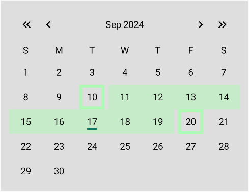
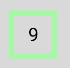
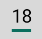
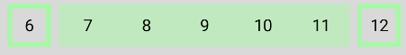

# RangeCalendar

This example shows the feature customization in the library.

The main feature here is the range selection in the calendar.

The final calendar looks like this:



Content:
* [ViewState](#viewstate)
* [Helper](#helper)
* [UI](#ui)
  * [RangeCalendarDayContent](#rangecalendardaycontent)
  * [RangeCalendarDay](#rangecalendarday)
  * [RangeCalendarDays](#rangecalendardays)
* [ViewModel](#viewmodel)

## ViewState
You see the explanation of the viewStates in the [README.md](https://github.com/LeoSvjetlicic/CalendarLibrary/blob/main/README.md/#viewstates) file.

First you need to create a new viewState that will hold the data for the range, like this:
``` kotlin
data class RangeCalendarViewState(
    override val headerViewState: CalendarHeaderViewState,
    override val weekDaysViewState: CalendarWeekDaysViewState,
    override val daysViewState: CalendarDaysViewState,
    val selectedRange: Selected.DayRange
) : ICalendarViewState
```
The extra parameter is `selectedRange` that represents the selected range of days and is of type [Selected](https://github.com/LeoSvjetlicic/CalendarLibrary/blob/main/calendarLibrary/src/main/java/com/leosvjetlicic/calendarlibrary/utils/Selected.kt).

Next you need to create the viewState that represents the **Day**. You can do so by inheriting from `ICalendarDay` like this:
``` kotlin
data class RangeCalendarDayViewState(
    override val value: LocalDate,
    override val isSelected: Boolean,
    override val isCurrentMonth: Boolean,
    override val isToday: Boolean,
    val isInRange: Boolean
) : ICalendarDay
```

The extra parameter is `isInRange` that represents whether the day is within the selected range.

## Helper
Now that you have the data classes, you need to generate them.

You can do so by creating a helper class like this:
``` kotlin 
class RangeCalendarHelper(
    override val weekDays: List<DayOfWeek>
) : BaseCalendarHelper(weekDays) {
    ...
)
```
and overriding the `generateCalendarViewState` function:
``` kotlin
override fun generateCalendarViewState(
    year: Int,
    month: Month,
    weekDayStyle: TextStyle,
    monthStyle: TextStyle,
    locale: Locale,
    selected: Selected?
): RangeCalendarViewState {
    ...
}
```
Parameters:
* **year** - The year for which to generate the calendar.
* **month** - The month for which to generate the calendar.
* **weekDayStyle** - The text style for formatting weekday names.
* **monthStyle** - The text style for formatting month names.
* **locale** - The locale for which to generate the calendar.
* **selected** - The selected date information of type [Selected](https://github.com/LeoSvjetlicic/CalendarLibrary/blob/main/calendarLibrary/src/main/java/com/leosvjetlicic/calendarlibrary/utils/Selected.kt). 

It returns the `RangeCalendarViewState`, which means you need to implements its mapping in the function.

Firstly you need to generate the data, like this:
``` kotlin
override fun generateCalendarViewState(
    ...
): RangeCalendarViewState {
    val currentDay = LocalDate.now()
    val weeks = generateWeeks(year, month)
    val tempSelected = if (selected != null) {
        (selected as Selected.DayRange)
    } else {
        Selected.DayRange(null, null)
    }
    ...
}
```
In the code above, you created the following:
* currentDay - the current date
* weeks - the generated weeks
* tempSelected - a selected range 

Then you need to map the data to the viewState, like this:
``` kotlin
override fun generateCalendarViewState(
    ...
): RangeCalendarViewState {
    ...
    return RangeCalendarViewState(
        headerViewState = CalendarHeaderViewState(
            currentDate = month.getDisplayName(monthStyle, locale) + " $year"
        ),
        weekDaysViewState = CalendarWeekDaysViewState(getDaysOfWeekNames(weekDayStyle, locale)),
        ...
        selectedRange = tempSelected
    )
}
```

The above code creates the data for the `header`, the `week days` and the `selected range`.

Next you need to map the days, like this:
``` kotlin
override fun generateCalendarViewState(
    ...
): RangeCalendarViewState {
    ...
    return RangeCalendarViewState(
        ...
        daysViewState = CalendarDaysViewState(
            days = weeks.map { days ->
                days.map { day ->
                    RangeCalendarDayViewState(
                        value = day,
                        isSelected = day == tempSelected.startDay || day == tempSelected.endDay,
                        isToday = day == currentDay,
                        isCurrentMonth = day.monthValue == month.value && day.year == year,
                        isInRange = if (tempSelected.startDay != null && tempSelected.endDay != null) {
                            tempSelected.startDay!! <= day && tempSelected.endDay!! >= day
                        } else {
                            false
                        }
                    )
                }
            }
        ),
        ...
    )
}
```

The data is mapped so it sets the following element:
* `value` - the day
* `isSelected` - is the day selected
* `isToday` - is the day today's date
* `isCurrentMonth` - is the day part of the current month
* `isInRange` - is the day within a selected range (if the range exists)

The function looks like this:
<details>
  <summary>Expand</summary>

  ``` kotlin
  override fun generateCalendarViewState(
        year: Int,
        month: Month,
        weekDayStyle: TextStyle,
        monthStyle: TextStyle,
        locale: Locale,
        selected: Selected?
    ): RangeCalendarViewState {
        val currentDay = LocalDate.now()
        val weeks = generateWeeks(year, month)
        val tempSelected = if (selected != null) {
            (selected as Selected.DayRange)
        } else {
            Selected.DayRange(null, null)
        }
        return RangeCalendarViewState(
            headerViewState = CalendarHeaderViewState(
                currentDate = month.getDisplayName(monthStyle, locale) + " $year"
            ),
            weekDaysViewState = CalendarWeekDaysViewState(getDaysOfWeekNames(weekDayStyle, locale)),
            daysViewState = CalendarDaysViewState(
                days = weeks.map { days ->
                    days.map { day ->
                        RangeCalendarDayViewState(
                            value = day,
                            isSelected = day == tempSelected.startDay || day == tempSelected.endDay,
                            isToday = day == currentDay,
                            isCurrentMonth = day.monthValue == month.value && day.year == year,
                            isInRange = if (tempSelected.startDay != null && tempSelected.endDay != null) {
                                tempSelected.startDay!! <= day && tempSelected.endDay!! >= day
                            } else {
                                false
                            }
                        )
                    }
                }
            ),
            selectedRange = tempSelected
        )
    }
  ```

</details>

You can also override other functions if needed.
## UI
To find all the compose functions used for UI in the library, to understand their parameters and how they work, you can visit the [Composables.md](https://github.com/LeoSvjetlicic/CalendarLibrary/blob/main/docs/composables/Composables.md) file.

The UI is similar to the [SimpleCalendarExample](https://github.com/LeoSvjetlicic/CalendarLibrary/blob/main/docs/examples/simplecalendar/SimpleCalendar.md), except the range elements.

### RangeCalendarDayContent
The `RangeCalendarDayContent` function uses the `BaseCalendarDayContent` provided in the library and the reason is because the `BaseCalendarDayContent` has the same width and height.

That allows you to create a square shape that will show what day is selected, like this:



The image above is created like this:
``` kotlin
@Composable
fun BoxScope.RangeCalendarDayContent(
    ...
) {
    BaseCalendarDayContent(
        onClick = onClick,
        modifier = modifier
            .then(
                if (day.isSelected && day.isCurrentMonth) {
                    Modifier.border(
                        width = 4.dp,
                        color = LightGreen,
                        shape = RoundedCornerShape(0.dp)
                    )
                } else {
                    Modifier
                }
            )
            .align(Alignment.Center),
        ...
    )
}
```
You just need to add a border if the day is selected and add the shape.

You can also pass parameters to customize it and if you want the rectangular shape you can add tha same modifier in the next subtopic (RangeCalendarDay).

The indicator is also changed to a rectangular shape and looks like this:



This is achieved like so:
``` kotlin
  @Composable
fun BoxScope.RangeCalendarDayContent(
    ...
) {
    BaseCalendarDayContent(
        ...
        indicator = {
            Spacer(
                modifier = Modifier
                    .align(Alignment.BottomCenter)
                    .width(15.dp)
                    .height(2.5.dp)
                    .background(DarkGreen)
            )
        }
    )
}
```

### RangeCalendarDay
To show the range in this example, you just need to change the background of each day that is in the range.

It will look like this:



This is archived like so:
``` kotlin
@Composable
fun RowScope.RangeCalendarDay(
    day: ICalendarDay,
    modifier: Modifier = Modifier,
    onClick: (LocalDate) -> Unit,
    content: @Composable BoxScope.() -> Unit = {
        RangeCalendarDayContent(
            day = day as RangeCalendarDayViewState,
            onClick = onClick
        )
    }
) {
    CalendarDay(
        modifier = modifier
            .weight(1f)
            .then(
                if (day is RangeCalendarDayViewState && day.isInRange && day.isCurrentMonth && !day.isSelected) {
                    Modifier.background(
                        color = LightGreen.copy(alpha = 0.5f),
                        shape = RoundedCornerShape(0.dp)
                    )
                } else {
                    Modifier
                }
            ),
        viewState = day,
        content = {
            content()
        }
    )
}
```
You just add a `then` modifier that checks if the day is in range.

Also you need to pass the `RangeCalendarDayContent` you created earlier as the content. 

### RangeCalendarDays

Finally, you need to create the `RangeCalendarDays` that will put all the days in a grid that looks like this:


You can create this using the `CalendarDays` composable function provided in the library like this:
``` kotlin
  @Composable
fun RangeCalendarDays(
    viewState: CalendarDaysViewState,
    modifier: Modifier = Modifier,
    onClick: (LocalDate) -> Unit = {},
    content: @Composable RowScope.(ICalendarDay) -> Unit = { day ->
        RangeCalendarDay(day = day, onClick = onClick)
    }
) {
    CalendarDays(
        viewState = viewState,
        modifier = modifier,
        onClick = onClick
    ) { weekDays ->
        Row(
            modifier = modifier.fillMaxWidth(),
            verticalAlignment = Alignment.CenterVertically,
            horizontalArrangement = Arrangement.SpaceEvenly
        ) {
            weekDays.forEach { day ->
                content(day)
            }
        }
    }
}
```

Apart from putting the elements in a `Row` you need to pass the `RangeCalendarDay` from the previous subtopic.

## ViewModel

Now that we have our `viewState`, `helper` that generates data and the `UI`, we can create a **viewModel** to ensure the **persistence** of the calendar.

To can create the ViewModel you can inherit the basic functionalities from the `BaseViewModel` like so:
``` kotlin
class RangeViewModel(
    helper: RangeCalendarHelper,
    selected: Selected = Selected.DayRange(null, null),
    copyViewState: (ICalendarViewState, CalendarDaysViewState, Selected) -> ICalendarViewState
) : BaseViewModel(helper, selected, copyViewState) {
...
}
```

Then, you need to change the `onDayClick` function, because the default functionality is for single date pick.

The function is quite complex as you can see here:

<details>
  <summary>Expand</summary>

``` kotlin
override fun onDayClick(clickedDay: LocalDate) {
        var newStartDate =
            (selected as Selected.DayRange).startDay
        var newEndDate =
            (selected as Selected.DayRange).endDay
        val selectedDaysSum =
            if (newEndDate != null && newStartDate != null) 2 else {
                if (newEndDate != null || newStartDate != null) 1 else 0
            }
        when (selectedDaysSum) {
            0 -> newStartDate = clickedDay
            1 -> {
                if (clickedDay == newStartDate) {
                    newStartDate = null
                } else if (newStartDate != null && clickedDay < newStartDate) {
                    newEndDate =
                        newStartDate
                    newStartDate = clickedDay
                } else if (clickedDay == newEndDate) {
                    newEndDate = null
                } else if (newEndDate != null && clickedDay > newEndDate) {
                    newStartDate =
                        newEndDate
                    newEndDate = clickedDay
                } else {
                    if (newStartDate == null) {
                        newStartDate = clickedDay
                    } else {
                        newEndDate = clickedDay
                    }
                }
            }

            2 -> {
                if (clickedDay != newStartDate && clickedDay != newEndDate) {
                    val middle = if (newStartDate != null && newEndDate != null) {
                        getMiddleDate(newStartDate, newEndDate)
                    } else {
                        null
                    }
                    if (clickedDay < middle) {
                        newStartDate = clickedDay
                    } else {
                        newEndDate = clickedDay
                    }
                } else {
                    if (newStartDate == clickedDay) {
                        newStartDate = null
                    } else if (newEndDate == clickedDay) {
                        newEndDate = null
                    }
                }
            }
        }

        val newDays = viewState.value.daysViewState.days.map { week ->
            week.map { d ->
                d as RangeCalendarDayViewState
                when (d.value) {
                    newStartDate -> d.copy(
                        isSelected = true,
                        isInRange = newEndDate != null
                    )

                    newEndDate -> d.copy(
                        isSelected = true,
                        isInRange = newStartDate != null
                    )

                    else -> d.copy(
                        isSelected = false,
                        isInRange = newStartDate != null && newEndDate != null && d.value > newStartDate && d.value < newEndDate
                    )
                }
            }
        }
        val newDaysViewState = viewState.value.daysViewState.copy(
            days = newDays,
        )
        selected = (selected as Selected.DayRange).copy(
            startDay = newStartDate,
            endDay = newEndDate
        )
        viewState.value = copyViewState(
            viewState.value,
            newDaysViewState,
            selected
        )
    }
```
</details>

That is why i won't explain it in detail, but it works like this:
1. Finds out how many days are selected (0,1 or 2)
2. Update the selected days
   * 0
      * set the newStartDate to the clicked day
   * 1
     * set the endDate, but checks what date is bigger and order them
   * 2
      * if the clicked day is not one of the selected, set the closer selected day to the clicked day
      * else set the selected day equal to the clicked day to `null`
3. Map the days (isSelected, inRange)
4. Update the viewState

Then you need to create a factory for the viewModel and then you can finally use it.

The result in the end is this:


## Conclusion

In this guide, we covered the basics on how to add features to a calendar.

You can see more examples [here](https://github.com/LeoSvjetlicic/CalendarLibrary/blob/main/docs/examples).

Good luck!
