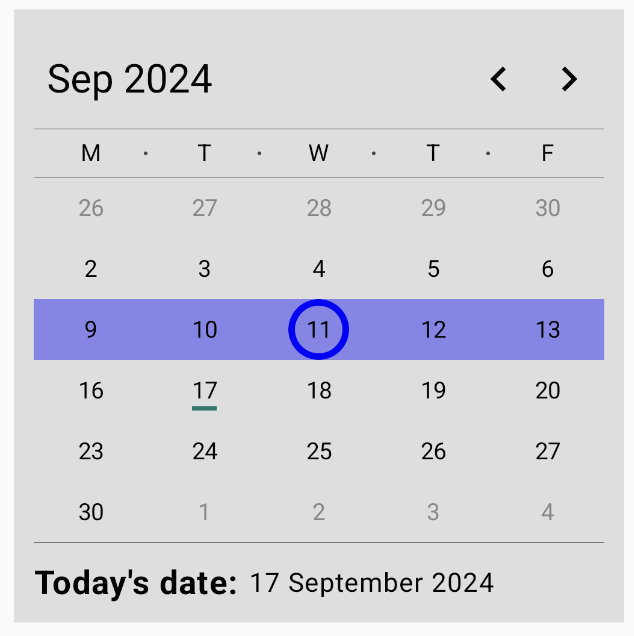
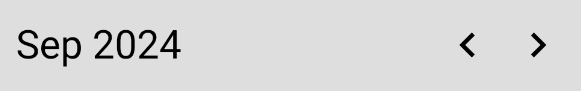
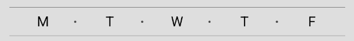
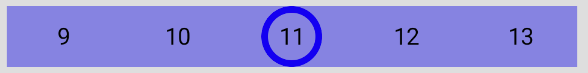
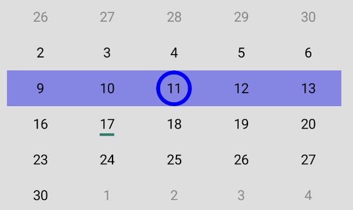

# SimpleCalendar

In this example we will target the customizability of the libraries UI.

You will add new parts, and customize the existing ones by changing their parameters, color for example.

The finished product will look like this:



The guide is separated into these subtopics:
* [ViewState](#viewstate)
* [Helper](#helper)
* [UI](#ui)
  * [Header](#header)
  * [WeekDays](#weekdays)
  * [SimpleDay](#simpleday)
  * [SimpleDaysRow](#simpledays)
  * [ExtraContent](#extracontent)
  * [Calendar](#calendar)
* [ViewModel](#viewmodel)

## ViewState

As you can see in the image above, a new part is added to it, the **today's date**

To be able to show it on the calendar you need to add that value to the ViewState, like this:
``` kotlin
    data class SimpleCalendarViewState(
    override val headerViewState: CalendarHeaderViewState,
    override val weekDaysViewState: CalendarWeekDaysViewState,
    override val daysViewState: CalendarDaysViewState,
    val today: String
) : ICalendarViewState
```

You override the ICalendarViewState and add our new parameter `today`.

Now you need to create a `helper` that will generate the new `ViewState`.

## Helper

You create the helper by inheriting from the `BaseCalendarHelper`, because you want to customize only the `generateCalendarViewState` function.

You inherit it like this:
``` kotlin
class SimpleCalendarHelper(
    override val weekDays: List<DayOfWeek>
) : BaseCalendarHelper(weekDays) {
    override fun generateCalendarViewState(
        year: Int,
        month: Month,
        weekDayStyle: TextStyle,
        monthStyle: TextStyle,
        locale: Locale,
        selected: Selected?
    ): SimpleCalendarViewState {
        ...
    }
}
```

As already said you only override the `generateCalendarViewState` function like this:
``` kotlin
override fun generateCalendarViewState(
    ...
): SimpleCalendarViewState {
    val currentDay = LocalDate.now()
    val weeks = generateWeeks(year, month)
    ...
}
```

As seen above first you get the current date and generate the weeks. After that you create the `SimpleCalendarViewState` and return it like this:
``` kotlin
override fun generateCalendarViewState(
    ...
): SimpleCalendarViewState {
    ...
    return SimpleCalendarViewState(
        headerViewState = CalendarHeaderViewState(
            currentDate = month.getDisplayName(monthStyle, locale) + " $year"
        ),
        weekDaysViewState = CalendarWeekDaysViewState(getDaysOfWeekNames(weekDayStyle, locale)),
        daysViewState = CalendarDaysViewState(
            days = weeks.map { days ->
                days.map { day ->
                    CalendarDayViewState(
                        value = day,
                        isSelected = selected is Selected.SingleDay && selected.day != null &&
                                selected.day == day,
                        isToday = day == currentDay,
                        isCurrentMonth = day.month == month && day.year == year
                    )
                }
            }
        ),
        today = currentDay.format(DateTimeFormatter.ofPattern("d MMMM yyyy"))
    )
}
```

The only different part was the `today` parameter, where you add the current date in a format you wanted.

That is the only functionality you added to this calendar example.

## UI
To find all the compose functions used for UI in the library, to understand their parameters and how they work, you can visit the [Composables.md](https://github.com/LeoSvjetlicic/CalendarLibrary/blob/main/docs/composables/Composables.md) file.

In the UI part we will change quite a lot of elements.

The example itself isn't very pretty, but it was created for the sole reason of showing the **customizability** of the library.

This part is separated in the following subtopics:
* [Header](#header)
* [WeekDays](#weekdays)
* [Day](#simpleday)
* [ExtraContent](#extracontent)

### Header

The header in this example uses only some `CalendarHeaderAction`.

As you can see in the image below it has content and 2 action buttons.



To create the `SimpleHeader` you need to provide the following parameters:
``` kotlin
@Composable
fun SimpleHeader(
    viewState: CalendarHeaderViewState,
    modifier: Modifier = Modifier,
    invertedOrder: Boolean = false,
    onAction: (CalendarHeaderAction) -> Unit,
    firstIconContent: @Composable () -> Unit = {
        ...
    },
    secondIconContent: @Composable () -> Unit = {
        ...
    },
    content: @Composable RowScope.() -> Unit = {
        ...
    }
) {
    ...
}
```
Parameters:
* `viewState` - CalendarHeaderViewState you created
* `modifier` - `Modifier`
* `invertedOrder` - value that allows you to invert the order of the content and action buttons.
* `onAction` - lambda function triggered in click actions.
* `firstIconContent` - lambda function that represents the first "Action Button"
* `secondIconContent` - lambda function that represents the second "Action Button"
* `content` - lambda function that represents the content

The action buttons are created by passing different parameters to the elements in the library like this:
``` kotlin
BaseActionButtonContent(
    modifier = modifier,
    iconId = iconId,
    iconSize = 30.dp,
    onClick = onClick
)
```
Basically they are just bigger.

The content is the same, only the size changed like this:
``` kotlin
BaseCalendarHeaderContent(
    viewState = viewState,
    onAction = onAction,
    textStyle = TextStyle.Default.copy(fontSize = 24.sp)
)
```

To get back to the `header` you create it like this:
``` kotlin
@Composable
fun SimpleHeader(
    ...
) {
    Row(
        modifier = modifier,
        verticalAlignment = Alignment.CenterVertically,
        horizontalArrangement = Arrangement.SpaceBetween
    ) {
        if (!invertedOrder) {
            content()
        }
        Row {
            firstIconContent()
            secondIconContent()
        }
        if (invertedOrder) {
            content()
        }
    }
}
```

Basically you add the content before or after the `action buttons` depending on the value of `invertedOrder`.

They are arranged to be on the ends of the header.

As already said, this example uses only 3 of the 5 provided `CalendarHeaderActions` implemented like this:
``` kotlin
open fun onHeaderAction(action: CalendarHeaderAction) {
        when (action) {
            FirstLeadingAction -> {
                if (month.value.value == 1) {
                    month.value = Month.of(12)
                    year.intValue -= 1
                } else {
                    month.value = Month.of(month.value.value - 1)
                }
            }

            FirstTrailingAction -> {
                if (month.value.value == 12) {
                    month.value = Month.of(1)
                    year.intValue += 1
                } else {
                    month.value = Month.of(month.value.value + 1)
                }
            }

            SecondLeadingAction -> {}

            SecondTrailingAction -> {}

            ContentAction -> {
                year.intValue = LocalDate.now().year
                month.value = LocalDate.now().month
            }
        }
        viewState.value = helper.generateCalendarViewState(
            year = year.intValue,
            month = month.value,
            selected = selected
        )
    }
```

### WeekDays

In this example the `weekDays` are changed by customizing the format and by adding separators between them as can be seen here:



To create the `SimpleWeekDays` you need to provide the following parameters:
``` kotlin
@Composable
fun SimpleWeekDays(
    viewState: CalendarWeekDaysViewState,
    modifier: Modifier = Modifier,
    alignment: Alignment.Vertical = Alignment.CenterVertically,
    arrangement: Arrangement.Horizontal = Arrangement.SpaceAround,
    textStyle: TextStyle = TextStyle.Default
) {
    ...
}
```
Parameters:
* `viewState` - CalendarWeekDaysViewState you created
* `modifier` - `Modifier`
* `alignment` - The alignment of the days in a Row
* `arrangement` - The arrangement of the days in a Row
* `textStyle` - The text style of the days

The lines on the top and bottom are added like this:
``` kotlin
@Composable
fun SimpleWeekDays(
    ...
) {
    Column(modifier = modifier) {
        Spacer(
            modifier = Modifier
                .fillMaxWidth()
                .height(0.3.dp)
                .background(Color.DarkGray)
        )
        ...
        Spacer(
            modifier = Modifier
                .fillMaxWidth()
                .height(0.3.dp)
                .background(Color.DarkGray)
        )
    }
}
```

They are just Spacers with these modifiers:
* `fillMaxWidth` - fills the width
* `height` - sets the height 
* `background` - sets the color

As for the `week days`, they are `Text` composable functions in a `Row` with Spacers between them, like this:
``` kotlin
@Composable
fun SimpleWeekDays(
    ...
) {
    Column(modifier = modifier) {
        ...
        Row(
            modifier = Modifier.padding(vertical = 6.dp),
            verticalAlignment = alignment,
            horizontalArrangement = arrangement
        ) {
            Spacer(   
                    modifier = Modifier
                        .clip(CircleShape)
                        .size(2.dp)
                        .background(Color.Transparent)
            )
            viewState.daysOfWeek.forEachIndexed { index, it ->             
                Text(
                    modifier = Modifier.weight(1f),
                    text = it,
                    style = textStyle,
                    textAlign = TextAlign.Center
                )
                Spacer(
                    modifier = Modifier
                        .clip(CircleShape)
                        .size(2.dp)
                        .background(
                            if (index != viewState.daysOfWeek.size - 1) {
                                Color.DarkGray
                            } else {
                                Color.Transparent
                            }
                        )
                )
            }
        }
        ...
    }
}
```
The `Spacers` are added between **each** element and 2 transparent ones are added at the ends for better alignment with the days in the content.

The `Text` composable functions have a `weight` modifier so they fill the remaining space in the `Row` equally.

### SimpleDay

The example uses the libraries `CalendarDay` like this:
``` kotlin
@Composable
fun RowScope.SimpleDay(
    day: ICalendarDay,
    modifier: Modifier = Modifier,
    onClick: (LocalDate) -> Unit,
    content: @Composable BoxScope.() -> Unit = {
        SimpleDayContent(day = day, onClick = onClick)
    }
) {
    CalendarDay(
        modifier = modifier.weight(1f),
        viewState = day,
        content = {
            content()
        }
    )
}
```

What has changed is the `content` parameter, we pass the `SimpleDayContent` provided below.

It changes how each day looks like depending on if it:
* is selected
* is part of the current month
* is today

What is needed to create this content is the following:
``` kotlin
@Composable
fun BoxScope.SimpleDayContent(
    day: ICalendarDay,
    modifier: Modifier = Modifier,
    onClick: (LocalDate) -> Unit
) {
    ...
}
```
Parameters:
* `day` - ICalendarDay viewState
* `modifier` - `Modifier`
* `onClick` - function triggered on day click

Then we use the `BaseCalendarDay` provided in the library by modifying it with parameters and `modifiers`, passing the changed content and indicator .

**Passing content**
``` kotlin
@Composable
fun BoxScope.SimpleDayContent(
    ...
) {
    BaseCalendarDayContent(
        viewState = day,
        onClick = onClick,
        modifier = modifier
            .clip(CircleShape)
            .then(
                if (day.isSelected) {
                    Modifier.border(
                        width = 4.dp,
                        color = Color.Blue,
                        shape = CircleShape
                    )
                } else {
                    Modifier
                }
            )
            .align(Alignment.Center),
        selectedBackgroundColor = Color.Transparent,
        ...
    )
}
```
* add `clip` modifier so the ripple effect changes
* add `then` modifier that adds a border if the day is selected
* add `align` modifier to center the content

Since the `BaseCalendarDayContent` by default changes the background color for the selected day, you pass the `selectedBackgroundColor` parameter as transparent so you can handle it with the modifiers above.

Then you customize the text content like this:
``` kotlin
BaseCalendarDayTextContent(
    viewState = day,
    notCurrentMonthTextColor = Color.Gray,
    selectedTextColor = Color.Black
)
```

This will make the days that are not in the current month gray and selected days black.

You also pass an indicator like this:

``` kotlin
Spacer(
    modifier = Modifier
        .align(Alignment.BottomCenter)
        .width(15.dp)
        .height(2.5.dp)
        .background(DarkGreen)
)
```
Modifiers:
* `align` modifier to center the indicator
* `width` sets the width to 15 dp 
* `height` sets the height to 2.5 dp
* `background` sets the background color to `DarkGreen`
 
The final compose function looks like this:
<details>
  <summary>Expand</summary>

``` kotlin
@Composable
fun BoxScope.SimpleDayContent(
    day: ICalendarDay,
    modifier: Modifier = Modifier,
    onClick: (LocalDate) -> Unit
) {
    BaseCalendarDayContent(
        viewState = day,
        onClick = onClick,
        modifier = modifier
            .clip(CircleShape)
            .then(
                if (day.isSelected) {
                    Modifier.border(
                        width = 4.dp,
                        color = Color.Blue,
                        shape = CircleShape
                    )
                } else {
                    Modifier
                }
            )
            .align(Alignment.Center),
        selectedBackgroundColor = Color.Transparent,
        content = {
            BaseCalendarDayTextContent(
                viewState = day,
                notCurrentMonthTextColor = Color.Gray,
                selectedTextColor = Color.Black
            )
        },
        indicator = {
            Spacer(
                modifier = Modifier
                    .align(Alignment.BottomCenter)
                    .width(15.dp)
                    .height(2.5.dp)
                    .background(DarkGreen)
            )
        }
    )
}
```
</details>

### SimpleDays

`SimpleDays` uses the `CalendarDays` composable function provided within the library by changing the content parameter.

The `SimpleDays` has these parameters:
``` kotlin
@Composable
fun SimpleDays(
    viewState: CalendarDaysViewState,
    modifier: Modifier = Modifier,
    onClick: (LocalDate) -> Unit = {},
    content: @Composable RowScope.(ICalendarDay) -> Unit = { day ->
        SimpleDay(day = day, onClick = onClick)
    }
) {
    CalendarDays(
        viewState = viewState,
        modifier = modifier,
        onClick = onClick
    ) { weekDays ->
        ...
    }
}
```
Parameters:
* `viewState` - CalendarDaysViewState you created previously
* `modifier` - `Modifier`
* `onClick` - function triggered on day click
* `content` - composable function explained in the previous section

As the content to the `CalendarDays` you pass the following composable function:
``` kotlin
@Composable
fun SimpleDays(
    ...
) {
    CalendarDays(
        ...
    ) { weekDays ->
        Row(
            modifier = modifier
                .fillMaxWidth()
                .background(
                    if (weekDays.any { it.isSelected }) {
                        Color.Blue.copy(alpha = 0.4f)
                    } else {
                        Color.Transparent
                    }
                ),
            verticalAlignment = Alignment.CenterVertically,
            horizontalArrangement = Arrangement.SpaceEvenly
        ) {
            weekDays.forEach { day ->
                content(day)
            }
        }
    }
}
```
This allows us to customize each row however we want (example: rainbow colors)

In this example the whole row is blue, if it is selected as seen here:



And as the final result the `SimpleCalendarDays` look like this:



### ExtraContent

You can also add extra content to the calendar.

In this example, `Text` that shows the current date is added and it looks like this:


The Extra content takes the following parameters:
``` kotlin
@Composable
fun SimpleExtraContent(
    today: String,
    modifier: Modifier = Modifier
) {
    ...
}
```
Just a value to show, and a modifier.

Then you just add 2 `Texts` to a `Row` like this:
``` kotlin
@Composable
fun SimpleExtraContent(
    ...
) {
    Row(
        modifier = modifier,
        verticalAlignment = Alignment.CenterVertically
    ) {
        Text(
            text = "Today's date: ",
            fontSize = 20.sp,
            fontWeight = FontWeight.Bold
        )
        Text(
            text = today,
            fontSize = 16.sp,
        )
    }
}
```

### Calendar
Now that you have all the parts to create the `SimpleCalendarExample` you can put them together to make it look like this:

The compose function takes these parameters:
``` kotlin
@Composable
fun SimpleCalendarExample(
    viewState: SimpleCalendarViewState,
    modifier: Modifier = Modifier,
    onHeaderAction: (CalendarHeaderAction) -> Unit,
    onDayClick: (LocalDate) -> Unit
) {
   ...
}
```
Parameters:
* `viewState` - SimpleCalendarViewState you created previously
* `modifier` - `Modifier`
* `onHeaderAction` - function triggered on header action
* `onDayClick` - function triggered on day click

You now pass already created composable functions like this:
``` kotlin
@Composable
fun SimpleCalendarExample(
    ...
) {
    Calendar(
        ...
        header = {
            SimpleHeader(
                modifier = Modifier.fillMaxWidth(),
                viewState = viewState.headerViewState,
                onAction = onHeaderAction
            )
        },
        weekDays = {
            SimpleWeekDays(viewState = viewState.weekDaysViewState)
        },
        content = {
            SimpleDays(
                viewState = viewState.daysViewState,
                onClick = onDayClick
            )
            Spacer(
                modifier = Modifier
                    .fillMaxWidth()
                    .height(0.3.dp)
                    .background(Color.DarkGray)
            )
            SimpleExtraContent(
                today = viewState.today,
                modifier = Modifier.padding(top = 12.dp)
            )
        }
    )
}
```
* header - `SimpleHeader`
* weekDays -  `SimpleWeekDays`
* content - `SimpleDays` and `SimpleExtraContent` separated by a `Spacer` (line)

Finally the calendar looks like this:


## ViewModel

Now that we have our `viewState`, `helper` that generates data and the `UI`, we can create a **viewModel** to ensure the **persistence** of the calendar.

You can either create a completely new ViewModel, use the one provided in the library, or you can inherit from it.

The list of parameters needed to create the `BaseViewModel`, provided in the library looks like this:
``` kotlin
open class BaseViewModel(
    val helper: ICalendarHelper,
    protected var selected: Selected = Selected.SingleDay(null),
    val copyViewState: (ICalendarViewState, CalendarDaysViewState, Selected) -> ICalendarViewState
) : ViewModel() {
    ...
}
```
Parameters:
* `helper` - the helper that generates the viewState
* `selected` - the selected state of the calendar of type [Selected](https://github.com/LeoSvjetlicic/CalendarLibrary/blob/main/calendarLibrary/src/main/java/com/leosvjetlicic/calendarlibrary/utils/Selected.kt)
* `copyViewState` - the function that copies the viewState. Needed because the viewModel itself works with an `ICalendarViewState`, which is an interface and doesn't have the `copy` function.

The `BaseViewModel` provides the following:
* **viewState** - the state of the calendar
* **year** - current year shown on the calendar
* **month** - current month shown on the calendar
* **onDayClick** - function that handles user's clicks on individual calendar days
* **onHeaderAction** - function that handles user's clicks on individual header parts

A factory for the viewModel is also provided in the library so to create the ViewModel you just need to do the following:
``` kotlin
val simpleCalendarViewModel by viewModels<BaseViewModel> {
      BaseViewModelFactory(
          helper = simpleCalendarHelper,
          selected = Selected.SingleDay(null)
      ) { viewState, daysViewState, _ ->
          (viewState as SimpleCalendarViewState).copy(daysViewState = daysViewState)
      }
  }
```

## Conclusion

In this guide, we covered the how to use the composable functions provided in the library, how to use and customize them and how to add new elements to them.

You can also see other examples [here](https://github.com/LeoSvjetlicic/CalendarLibrary/blob/main/docs/examples).

Good luck!
